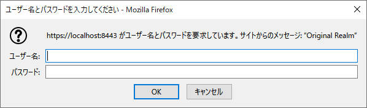
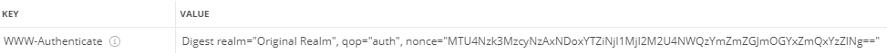

## :leaves: SpringBootでRESTful API(JSON)、HTTPS通信サンプル

#### 環境
```
開発環境：Eclipse 2020-06 R(4.16.0) Pleiades Spring Tool Suite プラグイン 4.7.2
言語：Java 11
デベロッパーSDK：Adopt OpenJDK 11.0.8
フレームワーク：Spring Boot 2.3.3 RELEASE
-Spring Framework 5.2.8 RELEASE
-サーブレットエンジン：Apache Tomcat 9.0.37
-テンプレートエンジン：Thymeleaf 3.0.11 RELEASE
-データベース接続：PostgreSQL JDBC 4.2 Driver 42.2.14
-O/R マッパー フレームワーク：Hibernate ORM 5.4.20 Final + JPA 2.2
-ログイン認証:Spring Security 5.3.4.RELEASE  
ログイン認証：Digest認証
データベース：PostgreSQL 12.4
-データベース管理ツール：PgAdmin 4.25
```

#### Digest認証／ブラウザ  


#### Digest認証／401レスポンスヘッダー例  
